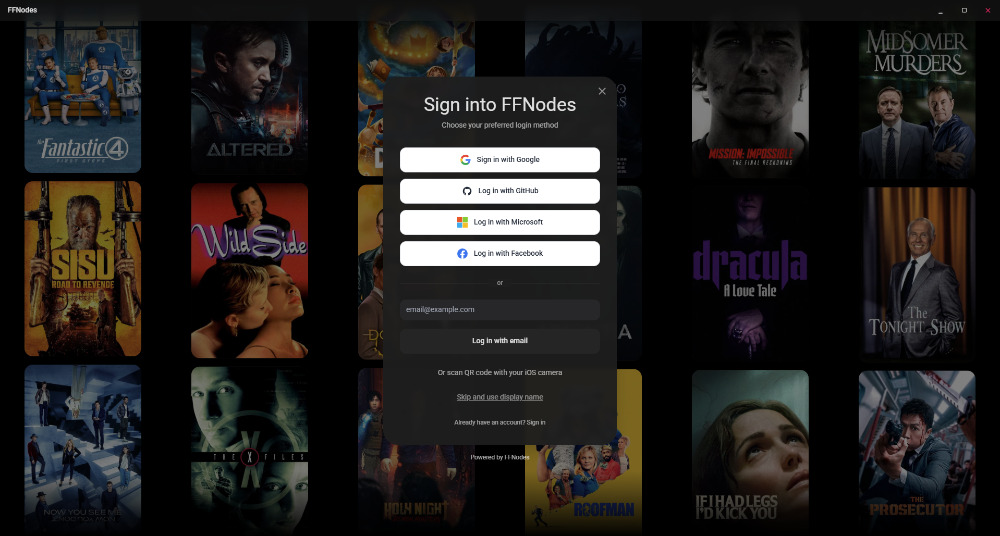
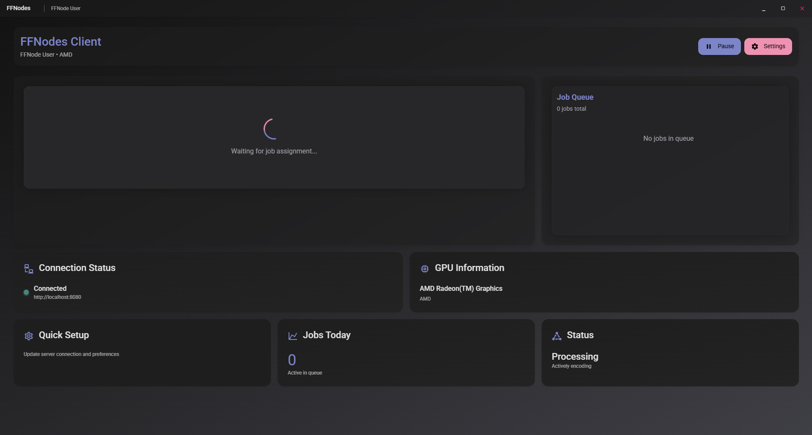
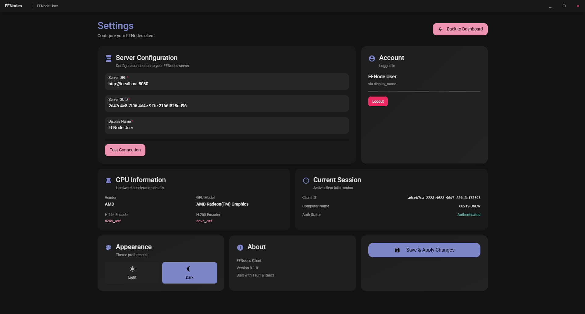

# FFNodes Client

<div align="center">



**A beautiful, modern distributed video encoding client built with Tauri, React, and Rust**

[](LICENSE)
[](https://tauri.app/)
[](https://reactjs.org/)
[](https://www.typescriptlang.org/)

</div>

---

## Overview

FFNodes Client is a powerful desktop application that connects to your FFNodes server to provide distributed video encoding capabilities. With a stunning Material Design 3 interface, OAuth authentication, and real-time encoding monitoring, it makes video transcoding seamless and efficient.

## Features

### Beautiful User Interface
- **Material Design 3** inspired interface with custom color system
- **Bento Grid Layout** for intuitive content organization
- **Light & Dark Mode** with smooth transitions and persistent preferences
- **Animated Login Flow** with movie poster background powered by TMDB API
- **Responsive Design** that adapts to any screen size

### Flexible Authentication
- **OAuth 2.0 Support** for Google, GitHub, Microsoft, and Facebook
- **Email-based Login** for quick access
- **Display Name Mode** for anonymous usage
- **QR Code Support** for mobile device authentication

### Powerful Features
- **Real-time Encoding Status** monitoring
- **GPU Hardware Acceleration** detection (H.264/H.265)
- **Server Connection Management** with connection testing
- **Job Queue Visualization** with progress tracking
- **System Information Display** (GPU, computer name, client ID)

### Video Encoding
- Distributed video transcoding across multiple clients
- Hardware-accelerated encoding support
- Real-time progress monitoring
- Automatic job assignment from server

---

## Screenshots

### Login Screen

*Beautiful login interface with animated movie poster background*

### Login Process

*Smooth 3-step authentication flow with server setup*

### Dashboard

*Clean, organized dashboard with Bento Grid layout showing active jobs and system status*

### Settings

*Comprehensive settings page with server configuration, GPU info, and theme controls*

---

## Tech Stack

### Frontend
- **[React 18.2](https://reactjs.org/)** - UI framework
- **[TypeScript 5.7](https://www.typescriptlang.org/)** - Type safety
- **[Tailwind CSS 3.4](https://tailwindcss.com/)** - Utility-first styling
- **[HeroUI](https://heroui.com/)** - Component library
- **[Framer Motion](https://www.framer.com/motion/)** - Animations
- **[React Router 7](https://reactrouter.com/)** - Navigation
- **[Zustand](https://zustand-demo.pmnd.rs/)** - State management
- **[Vite 6](https://vitejs.dev/)** - Build tool

### Backend
- **[Tauri 2.0](https://tauri.app/)** - Desktop application framework
- **[Rust](https://www.rust-lang.org/)** - Backend language
- **[Tokio](https://tokio.rs/)** - Async runtime
- **[Reqwest](https://github.com/seanmonstar/reqwest)** - HTTP client
- **[Serde](https://serde.rs/)** - Serialization
- **FFmpeg** - Video encoding engine

### Key Plugins
- **tauri-plugin-oauth** - OAuth 2.0 authentication
- **tauri-plugin-store** - Persistent storage
- **tauri-plugin-fs** - File system access
- **tauri-plugin-shell** - Shell command execution

---

## Getting Started

### Prerequisites

Before you begin, ensure you have the following installed:

- **[Node.js](https://nodejs.org/)** (v18 or higher)
- **[pnpm](https://pnpm.io/)** (v8.13.1 or higher)
- **[Rust](https://rustup.rs/)** (latest stable)
- **[FFmpeg](https://ffmpeg.org/)** (for encoding capabilities)

### Installation

1. **Clone the repository**
   ```bash
   git clone <repository-url>
   cd ffnodes/ffnodes-client
   ```

2. **Install dependencies**
   ```bash
   pnpm install
   ```

3. **Configure OAuth (Optional)**

   If you want to use OAuth authentication, you'll need to set up OAuth applications:

   - **Google**: [Google Cloud Console](https://console.cloud.google.com/)
   - **GitHub**: [GitHub OAuth Apps](https://github.com/settings/developers)
   - **Microsoft**: [Azure Portal](https://portal.azure.com/)
   - **Facebook**: [Meta for Developers](https://developers.facebook.com/)

   See [OAUTH_SETUP.md](OAUTH_SETUP.md) for detailed instructions.

4. **Set up environment variables**
   ```bash
   cp .env.example .env
   ```

   Edit `.env` and add your credentials:
   ```env
   # TMDB API Key (for movie poster backgrounds)
   VITE_TMDB_API_KEY=378ae44c6e7f5dde094cd8c8456378e0

   # OAuth Client IDs (optional)
   VITE_GOOGLE_CLIENT_ID=your_google_client_id
   VITE_GITHUB_CLIENT_ID=your_github_client_id
   VITE_MICROSOFT_CLIENT_ID=your_microsoft_client_id
   VITE_FACEBOOK_CLIENT_ID=your_facebook_client_id
   ```

### Development

Run the development server:

```bash
# Start frontend dev server
pnpm dev

# Or start the full Tauri app
pnpm tauri-dev
```

The application will open automatically, or you can access it at `http://localhost:5173`

### Building

Build the production application:

```bash
# Build frontend only
pnpm build

# Build complete Tauri application
pnpm tauri-build
```

The compiled application will be in `src-tauri/target/release/`

---

## Project Structure

```
ffnodes-client/
 src/                          # Frontend source code
    components/              # React components
       auth/               # Authentication components
       layout/             # Layout components (BentoGrid, etc.)
       ui/                 # UI primitives (Button, Input, etc.)
       MoviePosterScroll.tsx
       TitleBar.tsx
    pages/                   # Page components
       Dashboard.tsx
       Login.tsx
       Settings.tsx
       Setup.tsx
    services/                # API and service layers
       oauth.ts
       tmdb.ts
    stores/                  # Zustand state stores
       useAuthStore.ts
       useConfigStore.ts
       useThemeStore.ts
    types/                   # TypeScript type definitions
    css/                     # Global styles
    main.tsx                 # Application entry point
 src-tauri/                   # Tauri backend (Rust)
    src/
       api.rs              # API client for FFNodes server
       config.rs           # Configuration management
       oauth.rs            # OAuth implementation
       gpu.rs              # GPU detection
       lib.rs              # Main Rust entry point
    Cargo.toml              # Rust dependencies
    tauri.conf.json         # Tauri configuration
 res/                         # Resources (screenshots, videos)
 public/                      # Public assets
 tailwind.config.js          # Tailwind configuration
 package.json                # Node.js dependencies
 README.md                   # This file
```

---

## Themes

FFNodes Client supports both light and dark themes with carefully crafted Material Design 3 color palettes:

### Dark Mode (Default)
- Primary: Indigo (`#7986cb`)
- Secondary: Pink (`#f48fb1`)
- Success: Teal (`#4db6ac`)
- Background: `#121212`

### Light Mode
- Primary: Indigo (`#3f51b5`)
- Secondary: Pink (`#e91e63`)
- Success: Teal (`#009688`)
- Background: `#fafafa`

Switch between themes in **Settings → Appearance**.

---

## Configuration

### Server Setup

On first launch, you'll need to configure your FFNodes server connection:

1. **Server URL**: The HTTP(S) address of your FFNodes server (e.g., `http://localhost:8080`)
2. **Server GUID**: The secret authentication token for your server
3. **Display Name**: A friendly name for this client

You can test the connection before saving, and update these settings anytime in the Settings page.

### Client Configuration

Client configuration is stored in:
- **Windows**: `%APPDATA%/ffnodes-client/config.json`
- **macOS**: `~/Library/Application Support/ffnodes-client/config.json`
- **Linux**: `~/.config/ffnodes-client/config.json`

### Theme Preferences

Theme preferences are persisted in localStorage:
- Key: `ffnodes-theme`
- Value: `{ "state": { "theme": "dark" | "light" } }`

---

## Authentication

### OAuth Setup

For detailed OAuth configuration instructions, see [OAUTH_SETUP.md](OAUTH_SETUP.md).

### Quick Login Options

1. **OAuth** (Google, GitHub, Microsoft, Facebook)
   - Click the provider button
   - Authorize in your browser
   - Automatically redirected back to the app

2. **Email Login**
   - Enter your email address
   - Used as your display name

3. **Display Name**
   - Skip authentication entirely
   - Provide just a display name
   - Perfect for local/trusted networks

### Login Flow

The login process is a smooth 3-step experience:

1. **Authentication** - Choose your login method
2. **Server Setup** - Configure server connection
3. **Dashboard** - Start encoding!


---

## System Requirements

### Minimum Requirements
- **OS**: Windows 10/11, macOS 10.15+, or Linux
- **RAM**: 4 GB
- **Storage**: 100 MB for application + space for video files
- **Network**: Internet connection for OAuth and server communication

### Recommended Requirements
- **OS**: Windows 11, macOS 12+, or Linux (recent distro)
- **RAM**: 8 GB or more
- **GPU**: Hardware encoder support (NVIDIA NVENC, AMD VCE, Intel Quick Sync)
- **Storage**: SSD for faster encoding operations
- **Network**: High-speed connection for large video file transfers

### GPU Support

The client automatically detects your GPU and available hardware encoders:

- **NVIDIA**: NVENC (H.264/H.265)
- **AMD**: VCE/VCN (H.264/H.265)
- **Intel**: Quick Sync Video (H.264/H.265)
- **Apple**: VideoToolbox (H.264/H.265)

---

## API Integration

The client communicates with the FFNodes server via REST API:

### Endpoints Used

- `POST /api/clients/register` - Register client with server
- `GET /api/clients/:id/jobs` - Fetch assigned encoding jobs
- `POST /api/jobs/:id/progress` - Report encoding progress
- `POST /api/jobs/:id/complete` - Mark job as completed
- `GET /api/server/info` - Get server information

### Connection Testing

The client includes a connection tester that validates:
- Server accessibility
- Authentication validity
- API compatibility
- Network latency

---

## Troubleshooting

### Common Issues

**Client won't connect to server**
- Verify server URL is correct and accessible
- Check server GUID matches your server configuration
- Ensure firewall allows connections
- Test connection using the "Test Connection" button

**OAuth login fails**
- Verify OAuth credentials are correctly configured
- Check redirect URIs match your OAuth app settings
- Ensure browser allows pop-ups from the application
- Try clearing browser cookies/cache

**GPU not detected**
- Update graphics drivers to the latest version
- Verify FFmpeg supports your GPU (run `ffmpeg -encoders`)
- Check if hardware encoding is enabled in BIOS/UEFI
- Some GPUs may not support hardware encoding

**Theme not persisting**
- Check browser localStorage permissions
- Clear application cache and reload
- Verify `ffnodes-theme` key exists in localStorage

**Videos encoding slowly**
- Enable hardware encoding in server settings
- Check CPU/GPU usage during encoding
- Ensure sufficient RAM is available
- Verify FFmpeg is using hardware encoder (check logs)

### Logs

Application logs can be found:
- **Windows**: `%APPDATA%/ffnodes-client/logs/`
- **macOS**: `~/Library/Logs/ffnodes-client/`
- **Linux**: `~/.local/share/ffnodes-client/logs/`

---

## Documentation

- **[OAuth Setup Guide](OAUTH_SETUP.md)** - Complete OAuth configuration instructions
- **[Quick Start Guide](QUICKSTART.md)** - Get up and running quickly
- **[API Documentation](../docs/API.md)** - FFNodes API reference (if available)

---

## Contributing

Contributions are welcome! Please follow these steps:

1. Fork the repository
2. Create a feature branch (`git checkout -b feature/amazing-feature`)
3. Commit your changes (`git commit -m 'Add amazing feature'`)
4. Push to the branch (`git push origin feature/amazing-feature`)
5. Open a Pull Request

### Development Guidelines

- Follow existing code style and conventions
- Write meaningful commit messages
- Add tests for new features
- Update documentation as needed
- Ensure TypeScript compiles without errors (`pnpm exec tsc --noEmit`)
- Run linters before committing

---

## License

This project is licensed under the GNU General Public License v3.0 or later - see the [LICENSE](LICENSE) file for details.

---

## Author

**Drew Chase**
- GitHub: [@Drew-Chase](https://github.com/Drew-Chase)

---

## Acknowledgments

- **[Tauri Team](https://tauri.app/)** - Amazing desktop app framework
- **[TMDB](https://www.themoviedb.org/)** - Movie poster API for beautiful backgrounds
- **[HeroUI Team](https://heroui.com/)** - Excellent React component library
- **[FFmpeg Team](https://ffmpeg.org/)** - Powerful video encoding engine
- **Material Design 3** - Design inspiration and guidelines

---

## Roadmap

- [ ] Multi-language support (i18n)
- [ ] Advanced encoding profiles
- [ ] Encoding history and analytics
- [ ] Batch job management
- [ ] Real-time chat between clients
- [ ] Video preview before encoding
- [ ] Custom theme builder
- [ ] Plugin system for extensibility
- [ ] Mobile companion app

---

## Support

If you encounter any issues or have questions:

1. Check the [Troubleshooting](#-troubleshooting) section
2. Search [existing issues](../../issues)
3. Create a [new issue](../../issues/new) with detailed information
4. Join our community Discord *(add link if available)*

---

<div align="center">

**[⬆ back to top](#ffnodes-client)**

Made with ❤️ using Tauri, React, and Rust

</div>
